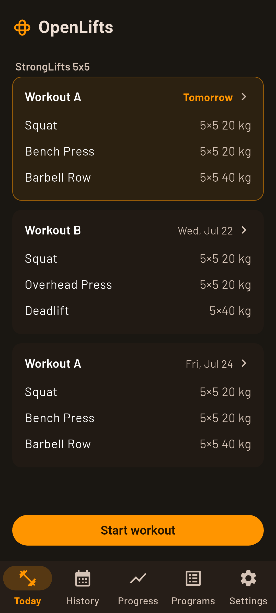
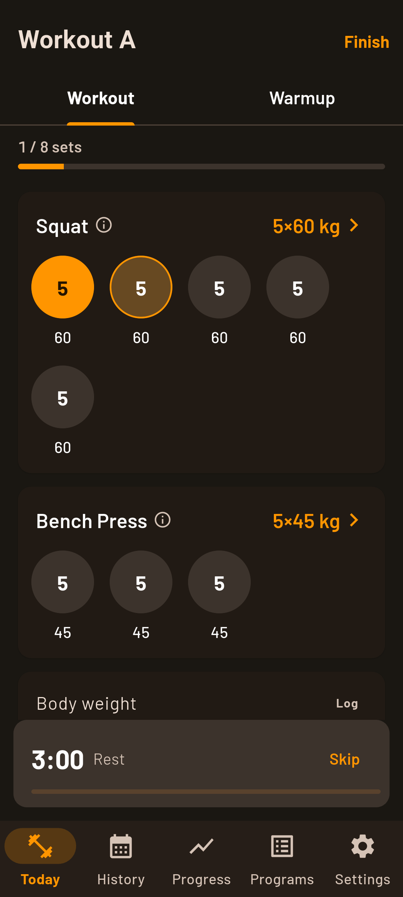
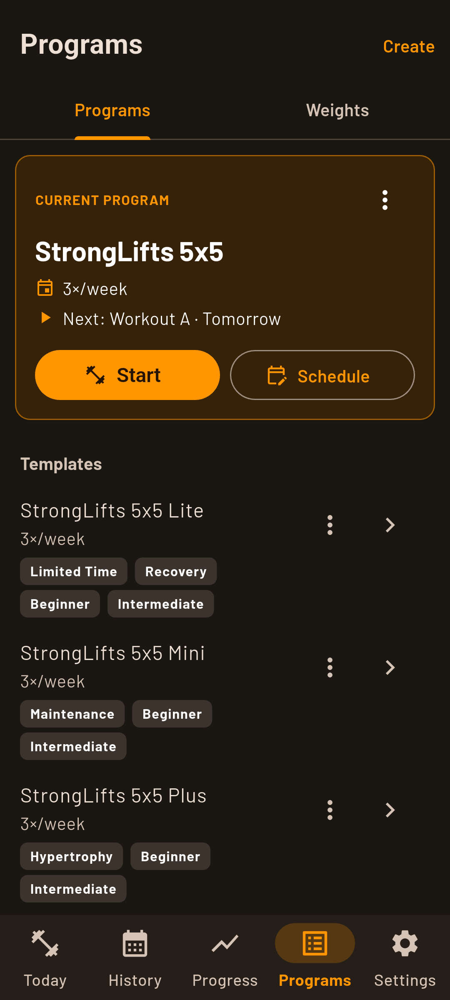
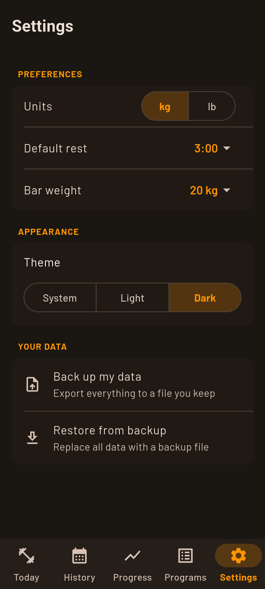

# OpenLifts

A local-first **StrongLifts 5×5** barbell strength tracker, built with Flutter
(Android + iOS). No account, no backend — your data stays on your device.

<p align="center">
  <a href="https://github.com/erdeneulzii/openlifts/releases/latest">
    
  </a>
</p>

> Working in this repo? Read [`AGENTS.md`](AGENTS.md) for the architecture,
> house patterns, and StrongLifts domain rules.

## Screenshots

<p align="center">
  
  
  
  
</p>
<p align="center"><sub>Today &middot; Workout &middot; Programs &middot; Settings</sub></p>

<sub>Captured from the real app on an emulator — see
[Regenerating screenshots](#regenerating-screenshots).</sub>

## Stack

- **State:** Riverpod + codegen (`@riverpod`)
- **Local data:** Drift/SQLite
- **Models:** freezed (for computed aggregates)
- **Navigation:** go_router · **Charts:** fl_chart
- **Lint:** very_good_analysis (strict) · **Tests:** flutter_test
- **Layout:** feature-first (`lib/features`, `lib/core`)

## First-time setup

Install the **Flutter SDK** (stable) and platform toolchains, verify with
`flutter doctor`, then from the repo root:

```bash
flutter pub get                             # dependencies
dart run build_runner build                 # codegen
git config core.hooksPath .githooks         # format/analyze/test hooks
flutter run
```

## Everyday commands

```bash
dart format .                # format
flutter analyze              # lint (must be clean)
flutter test                 # tests
dart run build_runner watch  # codegen while developing
```

## Regenerating screenshots

The README screenshots are captured from the real app running on an emulator
(authentic rendering). Boot an Android emulator, then from the repo root:

```bash
tool/screenshots.sh              # first booted emulator (usual case)
tool/screenshots.sh <device-id>  # from `adb devices`, e.g. emulator-5554
```

## Project layout

```
lib/
  main.dart     # ProviderScope root
  app.dart      # MaterialApp.router
  core/         # database, router, theme, units (cross-cutting)
  features/     # today, sessions, programs, progress, history, exercises, settings
```

## License

OpenLifts is free software under the [GNU GPLv3](LICENSE) — use it, study it,
share it, and improve it. Any distributed fork must stay open source under the
same license.

> The **"OpenLifts" name and logo are not covered by the code license.** Forks
> are welcome, but must use a different name and branding — please don't present
> a fork as the official OpenLifts.

See [CONTRIBUTING.md](CONTRIBUTING.md) to get involved.
